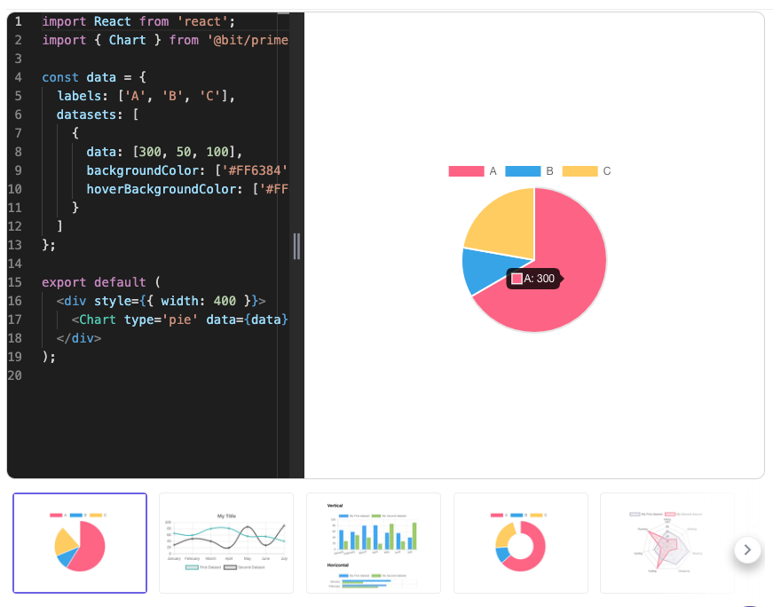

Bit.dev server is a cloud service provided by Bit. Accessing bit.dev server requires registering a user account on the bit.dev server. To export and import components from a local workspace to the account, a login is required from the local workspace. 

Bit.dev server provides these functions: 

## Remote Collections Hosting

A Remote Collection is a curated list of shared components on a remote server. The remote collection is used for collaborating on components between bit workspaces. Bit.dev provides hosting for remote collections for all the users.
Each remote collection contains the bit scope of its components as well as additional information on the collection: 

Collection name - The name by which the bit scope in the collection is available to developers for sharing or consuming components.  
Visibility - Determines who can view the Collection: A public collection is a free collection that is visible for all registered users. A private collection is limited to the organizations registered users. 
License - The default code license that is applicable for all the components shared in the collection (such as MIT, GPL or other licenses) 
Users & Roles - the users that have access to the collection and their roles on the collection (admin, developer or viewer).

### Collections Privacy

It is important to note that for security reasons:

1) Public components can not depend on private components
2) Components in private collections may only depend on components that belong to the same organization, but may not depend on components in private collections in other organizations. 

## Component Playground

The component playground is a web-based editor and a rendering environment for each component that is hosted on Bit.dev server. 
The component playground enables developing example wrappers for the component to show its usage. 

## Component CI

When a component is exported to bit.dev, the components CI (Continuous Integration) will run a container for building and testing the component, according to the compiler and tester that you have defined for it. The component is built in an isolated environment that contains all the packages and dependencies of the component, validating that the component is truly stand-alone and can be consumed by other projects.  
The results of the run are displayed on the component page on bit.dev. 
Once the build and test tasks are finished, the remote container is purged. 
The component is then available in the component playground.

bit.dev runs all build/test tasks for all components it hosts in their own isolated container.

When you are using Bit to export a component to a remote Collection hosted in [bit.dev](https://bit.dev), a container running Bit will import the new component, set up an isolated runtime environment for it, containins all the definitions found for the code component (pacakges, dependencies, etc). The output of it will be then populate the component page.  
This is so all developers using [bit.dev](https://bit.dev) will get build/test results for each component in a truly isolated environment on a remote container, which is purged after its done.

Each container is limited to: 

- 10 minute time limit.
- 2GB RAM.
- 0.5 CPU core.

Installed on each container: 

- Ubuntu jessie
- headless chrome driver
- latest version of Bit
- node 6.12

## Components Explorer

Bit.dev components explorer allows for a wide search across all the remote collections that the user can view such as the public collections and the user’s or organization's components. 
The component explorer is using metadata on the component such as tags, language, framework and size for advanced searching capabilities. 

Setting up a local server 

Bit.dev is a paid service (link to pricing page). 

Unlike Bit CLI tool that is open-sourced, Bit server is proprietary and owned by Bit. 

