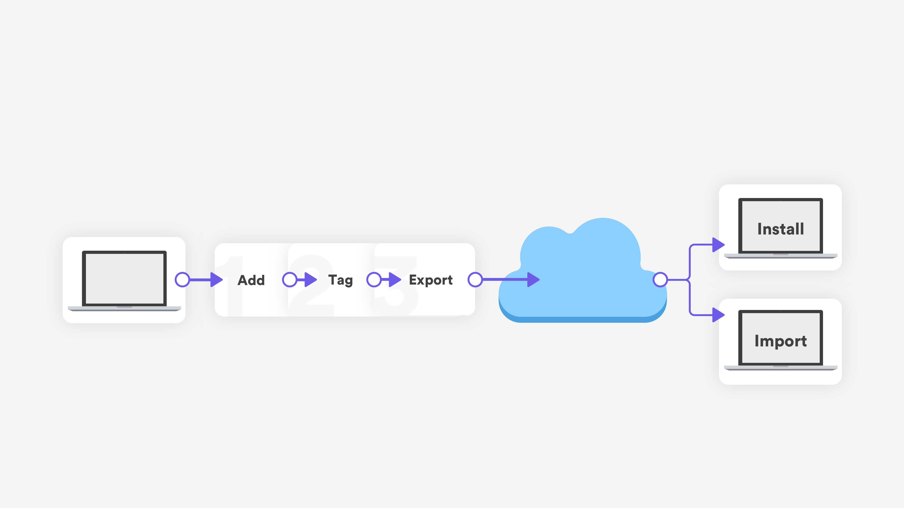

## What is Bit? 
Modern web architectures are built with components. [Encapsulated and reusable components](https://addyosmani.com/first/) with focused and well defined APIs are the building blocks for constructing software applications better and faster.
The major frontend frameworks, [React](https://reactjs.com), [Vue](https://vuejs.org/), and [Angular](https://angular.io) all share the concept of using components based architecture to compose state-of-the-art applications. Even the browsers themselves are now supporting components as an inherent feature by supporting the [Web Components](https://developer.mozilla.org/en-US/docs/Web/Web_Components) standards.

Projects and applications are built from components that are assembled together to create something bigger. This is usually a teamed collaborative process. 

​In Bit, each component is an encapsulated piece of code that handles a single responsibility, representing a well-defined functionality and composable with other components to build larger projects. Bit manages each component separately with its dependencies and compiling and testing utilities. 

Bit is designed to help teams scale the sharing and management of open sourced and closed source components to hundreds and even thousands of components.

## What Can Bit Do? 

### Isolated Component Environment
*Bit detaches the component from the rest of the project.*
By analyzing the component structure, each component is becoming a stand-alone entity that can be shared and used across multiple projects. Bit provides tools for building, testing, linting, linking and rendering each component in its own canned environments, so it is clear what the component is built upon. 

### Component Teamwork
*Bit allows teams to build applications with components from different projects.* 
A team can work together on a component’s shared code even when projects are located in separate Version Control repositories. Versions and changes are managed per each component, and changes from one component can bubble to the components that depend on it. 
Isolating each component from the rest of the project makes the introduction of a component in a new project a lightning-fast process. 

### Component Discovery
*Bit helps finding the right component for the project.*
Generic search tools (read: Google) can help in locating components only to a certain level. Finding the right component for the project usually requires drilling into the components behind what a search engine can provide. 
Bit provides a Components Hub with dedicated searching and filtering capabilities that can narrow the components search to list only the components that are adequate to your project, by language, framework, dependencies, and size. 
When searching components, each component is displayed in a fenced playground that make the component visual and shows how it can be used, built and tested. 

## How Does Bit work?
A **bit workspace** is a single project that is tracking components and sharing them. Components tracking is done using the **Bit CLI** commands. 
**Bit.dev** is a cloud-based components hub, that is used for publishing and sharing components between bit workspaces. 

### Bit Highlevel workflow

`bit add` a new component from a project with all the files that construct the component. The component is now tracked (in the .bitmap file in the workspace root). 
`bit import <compiler name> --compiler` to add an existing compiler to build the component. 
`bit tag` a component to seal a version of a component with all files at their current state. 
`bit export` the component to a remote Bit Collection to make it shareable to other users in your project or in the community. 
`bit install` the component in another Bit workspace to use it in another project. 
`bit import` the component in another Bit workspace to get its source code, so it can be modified and re-exported to the remote collection. 

## Is Bit...? 
### Is Bit the same as Git?
While bit reads and stores code, it is not a replacement for a project’s source control tool. Changes made to components that are exported or imported into a project should also be tracked in the relevant git repository. Bit does not require a source control to exist in the project, but if a source control like git exists, it will enhance it by using the git APIs to merge changes from remote collections. 

### Is Bit the same as NPM or Yarn? 
Bit components that are published to a remote collection and are successfully built, can be consumed by package managers like npm and Yarn. Bit points to a @bit registry for locating the components, which can be resolved by Yarn or NPM. It is required, however, that the package managers will be aware of the @bit prefix to be able to locate the component, and not search them in their default registries. 
Bit import is different from npm / yarn install, as it will make the source code of the component available in the project. 

### Is Bit the same as Storybook? 
While Storybook focuses on UI component development in isolation, Bit focuses on component collaboration and discovery. Bit.dev cloud has playground capabilities that allow rendering UI components and build examples that are similar to storybook stories. However, bit collections are not limited to work in a single repository and can show components from multiple projects on a single collection. 
